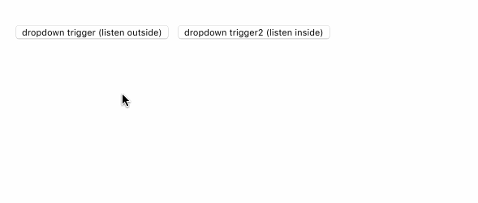

# NativeClickListener

A React helper component to listen the global native click event, can be used to implement the Dropdown menu easily.

## Description

### Implementation

    import React from 'react'
    import propTypes from 'prop-types'

    export default class NativeClickListener extends React.Component {
      static propsType = {
        listenInside: propTypes.bool,
        onClick: propTypes.func
      }

      static defaultProps = {
        listenInside: false
      }

      componentDidMount() {
        document.addEventListener('click', this.globalClickHandler)
      }

      componentWillUnmount() {
        document.removeEventListener('click', this.globalClickHandler)
      }

      globalClickHandler = (nativeEvent) => {
        const { onClick, listenInside } = this.props
        if (this._container &&
            this._container.contains(nativeEvent.target) &&
            !listenInside) return
        onClick(nativeEvent)
      }

      render() {
        return (
          
this._container=ref}>
            { this.props.children }
          

        )
      }
    }

### Usage

    class DropdownPage extends Component {
      constructor(props) {
        super(props)

        this.state = {
          dropdownVisible: false,
          dropdown2Visible: false
        }
      }

      render() {
        return (
          

            

              

                <button onClick={()=>this.setState({dropdownVisible: true})}>
                  dropdown trigger (listen outside)
                </button>
              

              {
                this.state.dropdownVisible &&
                <NativeClickListener
                  onClick={()=>this.setState({dropdownVisible: false})}>
                  

                    

                      <input type='checkbox'/>option 1
                    

                    

                      <input type='checkbox'/>option 2
                    

                  

                </NativeClickListener>
              }
            

            

              

                <button onClick={()=>this.setState({dropdown2Visible: true})}>
                  dropdown trigger2 (listen inside)
                </button>
              

              {
                this.state.dropdown2Visible &&
                <NativeClickListener
                  listenInside={true}
                  onClick={()=>this.setState({dropdown2Visible: false})}>
                  

                    

                      menu 1
                    

                    

                      menu 2
                    

                  

                </NativeClickListener>
              }
            

          

        )
      }
    }

Effect:

We even can dismiss the Dropdown menu by clicking a part of elements inside the menu.

    {
      this.state.dropdownVisible &&
      <NativeClickListener
        onClick={()=>this.setState({dropdownVisible: false})}>
        

          

            <input type='checkbox'/>option 1
          

          

            <input type='checkbox'/>option 2
          

          <button onClick={()=>this.setState({dropdownVisible: false})}>
            OK
          </button>
        

      </NativeClickListener>
    }

Effect:

## Notes

- [How to implement a perfect React Dropdown component](./notes/implement-react-drop-down.md)

## Related Projects

- [react-dropdown](https://github.com/baurine/react-dropdown)
