# How to implement a perfect React dropdown component

Dropdown is a very common component but a little different with other components, it needs to be dismissed when you click anywhere outside the dropdown component, but how does a React component handle the event happend outside it and its parent container?

## Implement a basic dropdown in React

Let's implement a primitive dropdown first.

    // DropdownPage.js
    import React, { Component } from 'react';
    import './DropdownPage.css';

    class DropdownPage extends Component {
      constructor(props) {
        super(props)
        this.state = {
          dropdownVisible: false
        }
      }

      toggleDropdown = (e) => {
        this.setState(prevState => ({dropdownVisible: !prevState.dropdownVisible}))
      }

      renderDropdownMenu() {
        return (
          

            

              <input type='checkbox'/>option 1
            

            

              <input type='checkbox'/>option 2
            

          

        )
      }

      render() {
        return (
          

            

              <button onClick={this.toggleDropdown}>
                dropdown trigger
              </button>
            

            {
              this.state.dropdownVisible &&
              this.renderDropdownMenu()
            }
          

        )
      }
    }

    export default DropdownPage;

The css file:

    // DropdownPage.css
    .dropdown-container {
      /* must assign container position as relative */
      position: relative;
      width: 200px;
    }

    .dropdown-trigger {
      padding: 10px 0px;
    }

    .dropdown-body {
      position: absolute;
      top: 100%;
      width: 100%;
      padding: 10px;

      background-color: white;
      box-shadow: 1px 1px 1px 1px #888888;

      z-index: 2;
    }

Notice the `.dropdown-container` position must be `relative` while the `.dropdown-body` position must be `absolute`.

How does it look like now:

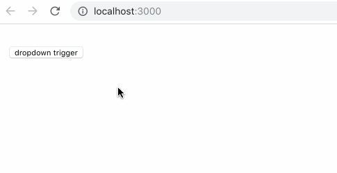

Now we can open and hide the dropdown menu by clicking the trigger button, but can't dimiss it by clicking outside the dropdown container.

## Try `onBlur` callback

So how can we do that, how can we receive the click event outside the dropdown container. If you are a newbie in frontend and React like me in months ago, after reading the React document, you may think the `onBlur` callback can help us to know something happend outside the component.

    handleBlur = (e) => {
      console.log('on blur')
      this.setState({dropdownVisible: false})
    }

    renderDropdownMenu() {
      return (
        

          

            <input type='checkbox'/>option 1
          

          

            <input type='checkbox'/>option 2
          

        

      )
    }

The effect:

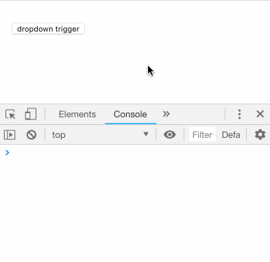

It works! but, just some times, not always. `onBlur` callback is called only after the dropdown menu getting the focus, if clicking outside the component happens before it is focused, the `onBlur` callback won't be called, and even if there are no elements can be focused inside the dropdown menu, the `onBlur` will never be called.

So `onBlur` is not our choice.

## Try `document.addEventListener()`

Let's recall how we implement dropdown by original JavaScript without any framework. we use `document.addEventListener('click', clickHandler)` to listen the click event happened anywhere, why not try it in React as well.

    componentDidMount() {
      document.addEventListener('click', this.globalClickListener)
    }

    componentWillUnmount() {
      document.removeEventListener('click', this.globalClickListener)
    }

    globalClickListener = (e) => {
      console.log('global click')
      this.setState({dropdownVisible: false})
    }

Don't forget to remove the click event handler in `compoenetWillUnmount()` lifecycle.

The effect:

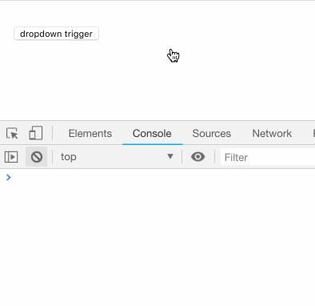

## Dynamically call `document.addEventListener()`

Err... seems the dropdown menu can't display anymore, why this happens? It is because the clicking button will trigger global click event as well. It seems we should add and remove the global click listener dynamically, only add it after dropdown menu displaying, and remove it after dropdown menu dismissing.

    // componentDidMount() {
    //   document.addEventListener('click', this.globalClickListener)
    // }

    componentWillUnmount() {
      document.removeEventListener('click', this.globalClickListener)
    }

    globalClickListener = (e) => {
      console.log('global click')
      this.setState({dropdownVisible: false}, () => {
        document.removeEventListener('click', this.globalClickListener)
      })
    }

    toggleDropdown = (e) => {
      this.setState(prevState => ({dropdownVisible: !prevState.dropdownVisible}), () => {
        if (this.state.dropdownVisible) {
          document.addEventListener('click', this.globalClickListener)
        }
      })
    }

The effect:

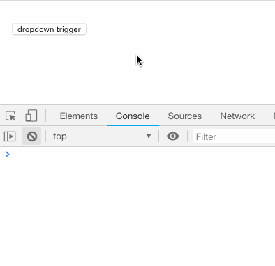

It works perfect when clicking outside the component, but, wait, why the dropdown menu dismisses when choosing the option inside the menu. If this is the expected result for you, because some dorpdown menus should dismiss by clicking anywhere even inside the menu after it opens, that's enough, we can stop, but here we want to keep it open if clicking inside the menu, so let's continue.

## `event.stopPropagation()` secret

The reason is same as above, because now we have listened the global click event, clicking inside the menu will trigger the global click handler as well, so we should stop the event propagate to document, the `event.stopPropagation()` API can do that, so let's add it for clicking inside the menu.

    toggleDropdown = (event) => {
      this.setState(prevState => ({dropdownVisible: !prevState.dropdownVisible}), () => {
        if (this.state.dropdownVisible) {
          document.addEventListener('click', this.globalClickListener)
        }
      })
    }

    handleBodyClick = (event) => {
      console.log('body click')
      event.stopPropagation()
    }

    renderDropdownMenu() {
      return (
        

          

            <input type='checkbox'/>option 1
          

          

            <input type='checkbox'/>option 2
          

        

      )
    }

The effect:

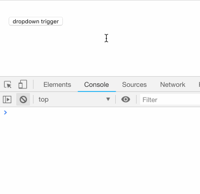

Wierd, it seems the `event.stopPropagation()` doesn't work at all, the event still propagates to the document. When we click inside the dropdown menu, the body click handler and global click handler both are called according to the log.

Why? That's the most important thing I learned from it: in React, there are 2 kinds of events.

- One is the Native Event, when we use `document.addEventListener()` API, we use it to handle the native event.
- Another one is the React Synthetic Event, it wraps the Native Event. When we pass the `onClick` callback to React component likes `
`, the callback is used to handle React Synthetic Event. But the more important thing is that all native events wrapped by synthetic events are binded in the document object instead of the component itself, we call this as proxy mode.

So that explains. When you click inside the dropdown menu, the `handleBodyClick(event)` is called, but the native event is already happened in the document, so `globalClickListener(event)` is called as well. Notice the former event is React synthetic event while the latter event is native event.

Let's verify it, log some information in `handleBodyClick` handler.

    handleBodyClick = (syntheticEvent) => {
      console.log('body click')
      console.log(syntheticEvent)
      console.log(syntheticEvent.nativeEvent)
      console.log(syntheticEvent.nativeEvent.path)
      syntheticEvent.stopPropagation()
    }

The output log after clicking the checkbox inside the dropdown menu:

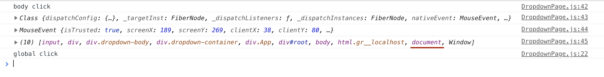

From `syntheticEvent.navtiveEvent.path` we can know that the native event is already propagate to the document, so the `syntheticEvent.stopPropagation()` just can stop the native event propagate to window, that remind me, why not we bind the global native click listener to the window object instead of document object.

Before trying that, let's summarize what the React Synthetic Event's `stopPropgation()` method can do:

1. Stop the native event propagte to window object
1. Stop the React synthetic event propgate to parent React components

## Try `window.addEventListener()`

Let's listen the native global click event in window object.

    componentWillUnmount() {
      // document.removeEventListener('click', this.globalClickListener)
      window.removeEventListener('click', this.globalClickListener)
    }

    globalClickListener = (nativeEvent) => {
      console.log('global click')
      this.setState({dropdownVisible: false}, () => {
        // document.removeEventListener('click', this.globalClickListener)
        window.removeEventListener('click', this.globalClickListener)
      })
    }

    toggleDropdown = (syntheticEvent) => {
      console.log('toggle dropdown')
      this.setState(prevState => ({dropdownVisible: !prevState.dropdownVisible}), () => {
        if (this.state.dropdownVisible) {
          // document.addEventListener('click', this.globalClickListener)
          window.addEventListener('click', this.globalClickListener)
        }
      })
    }

The effect:

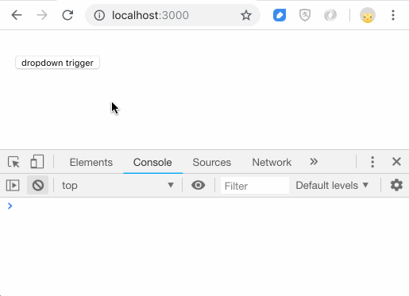

It looks much worse than before, even the dropdown can't open, don't worry, let's see what happened.

When we click the toggle button, `toggleDropdown()` is called, dropdownVisible is set to true, then we register the global native click listener in window, and the current native click event propagates to window object immediately, global native click listener is called, dropdownVisible is set to false, so finally, the dropdown menu doesn't open.

So the solution is simple, we just need to stop the native click event happened in toggle button propagate to window.

    toggleDropdown = (syntheticEvent) => {
      console.log('toggle dropdown')
      syntheticEvent.stopPropagation()
      this.setState(prevState => ({dropdownVisible: !prevState.dropdownVisible}), () => {
        if (this.state.dropdownVisible) {
          // document.addEventListener('click', this.globalClickListener)
          window.addEventListener('click', this.globalClickListener)
        }
      })
    }

The effect:

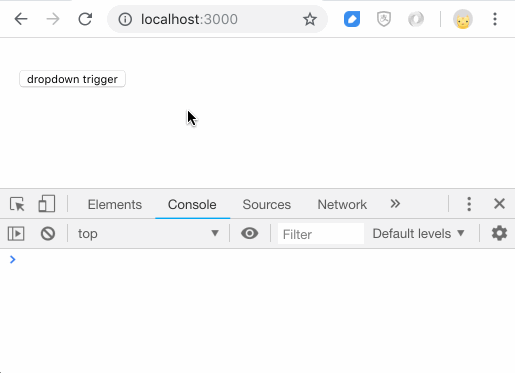

Finally it works perfect as we expect.

But, I need to say, it works at most time, but it is not really perfect. I just found it some time later when there are more than one dropdown menu in the same page.

## Pitfall

It is easy to understand, if there are 2 dropdown menus in the same page, when I open the first dropdown menu, then I click the second dropdown menu trigger button, because we call the `syntheticEvent.stopPropagation()` inside the trigger button click handler, so global native click handler won't be called, the first dropdown menu can't be dismissed.

Let's prove it, we add a new button which will call `event.stopPropagation()` when clicking it.

    render() {
      return (
        

          <button onClick={(e)=>e.stopPropagation()}>stop propagation</button>
          ...
        

      )
    }

The effect:

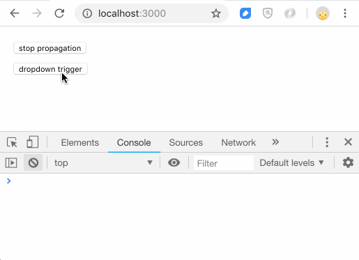

So, listening global native click event in window object and stopping propgataion is not the perfect way, we need to find a better solution.

## Try `node.contains()`

There is a DOM API called `node.contains(otherNode)`, it is used to check whether one node is inside in another node. So we can use this API to differ a click event happens inside the dropdown menu or outside it.

Let's try it, we abandon to stop propagation and come back to listen in document object, and use `node.contains()` API to judge whether a click event happens outside the dropdown menu, if it does, hide the dropdown menu, for to use this API, we need to use ref to save the DOM node in React.

    componentWillUnmount() {
      document.removeEventListener('click', this.globalClickListener)
    }

    globalClickListener = (nativeEvent) => {
      console.log('global click')
      // ignore click event happened inside the dropdown menu
      if (this._dropdown_body && this._dropdown_body.contains(nativeEvent.target)) return
      // else hide dropdown menu
      this.setState({dropdownVisible: false}, () => {
        document.removeEventListener('click', this.globalClickListener)
      })
    }

    toggleDropdown = (syntheticEvent) => {
      console.log('toggle dropdown')
      this.setState(prevState => ({dropdownVisible: !prevState.dropdownVisible}), () => {
        if (this.state.dropdownVisible) {
          document.addEventListener('click', this.globalClickListener)
        }
      })
    }

    handleBodyClick = (syntheticEvent) => {
      console.log('body click')
    }

    renderDropdownMenu() {
      return (
        
this._dropdown_body=ref}
             onClick={this.handleBodyClick}>
          

            <input type='checkbox'/>option 1
          

          

            <input type='checkbox'/>option 2
          

        

      )
    }

The effect:

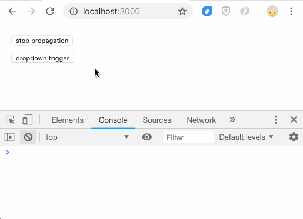

## Wrap to NativeClickListener component

Ok, now it finally works well as we expect, but let's go forward one step, if you have multiple dropdown menus in you project, you don't want to write the same code again and again, right? it makes sense to wrap it as an individual component, let's call it as NativeClickListener.

    import React from 'react'
    import propTypes from 'prop-types'

    export default class NativeClickListener extends React.Component {
      static propsType = {
        onClick: propTypes.func
      }

      componentDidMount() {
        document.addEventListener('click', this.globalClickHandler)
      }

      componentWillUnmount() {
        document.removeEventListener('click', this.globalClickHandler)
      }

      globalClickHandler = (nativeEvent) => {
        if (this._container && this._container.contains(nativeEvent.target)) return
        this.props.onClick(nativeEvent)
      }

      render() {
        return (
          
this._container=ref}>
            { this.props.children }
          

        )
      }
    }

Usage:

    toggleDropdown = (syntheticEvent) => {
      console.log('toggle dropdown')
      this.setState(prevState => ({dropdownVisible: !prevState.dropdownVisible}))
    }

    handleBodyClick = (syntheticEvent) => {
      console.log('body click')
    }

    renderDropdownMenu() {
      return (
        

          

            <input type='checkbox'/>option 1
          

          

            <input type='checkbox'/>option 2
          

        

      )
    }

    render() {
      return (
        

          

            <button onClick={this.toggleDropdown}>
              dropdown trigger
            </button>
          

          {
            this.state.dropdownVisible &&
            <NativeClickListener onClick={()=>this.setState({dropdownVisible: false})}>
              { this.renderDropdownMenu() }
            </NativeClickListener>
          }
        

      )
    }

We still can simplify the code, let's see the `toggleDropdown` method, after opening the dropdown menu by `setState({dropdownVisible: true})` when clicking trigger button first time, the NativeClickListener will be resposible for closing it by `setState({dropdownVisible: false})`, and it happens in the last, what ever dropdownVisible is set before, it will be covered by `setState({dropdownVisible: false})`, so trigger button doesn't need to care about closing dropdown menu, just care about opening it, the `toggleDropdown` method can be removed.

    <button onClick={()=>this.setState({dropdownVisible: true})}>
      dropdown trigger
    </button>

Sometimes we still need to close the dropdown menu even clicking inside the menu, so let's add a more prop for NativeClickListener to support this operation.

    static propsType = {
      listenInside: propTypes.bool,
      onClick: propTypes.func
    }

    globalClickHandler = (nativeEvent) => {
      const { onClick, listenInside } = this.props
      if (this._container &&
          this._container.contains(nativeEvent.target) &&
          !listenInside) return
      onClick(nativeEvent)
    }

Usage:

    class DropdownPage extends Component {
      constructor(props) {
        super(props)

        this.state = {
          dropdownVisible: false,
          dropdown2Visible: false
        }
      }

      render() {
        return (
          

            

              

                <button onClick={()=>this.setState({dropdownVisible: true})}>
                  dropdown trigger (listen outside)
                </button>
              

              {
                this.state.dropdownVisible &&
                <NativeClickListener
                  onClick={()=>this.setState({dropdownVisible: false})}>
                  

                    

                      <input type='checkbox'/>option 1
                    

                    

                      <input type='checkbox'/>option 2
                    

                  

                </NativeClickListener>
              }
            

            

              

                <button onClick={()=>this.setState({dropdown2Visible: true})}>
                  dropdown trigger2 (listen inside)
                </button>
              

              {
                this.state.dropdown2Visible &&
                <NativeClickListener
                  listenInside={true}
                  onClick={()=>this.setState({dropdown2Visible: false})}>
                  

                    

                      menu 1
                    

                    

                      menu 2
                    

                  

                </NativeClickListener>
              }
            

          

        )
      }
    }

Final effect:

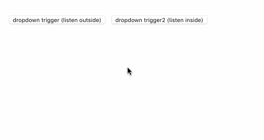
